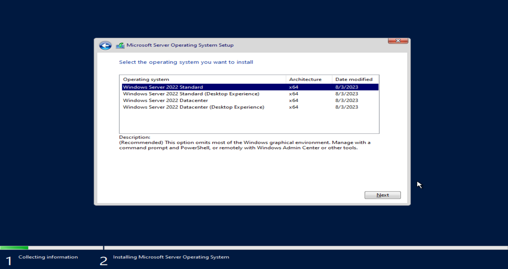
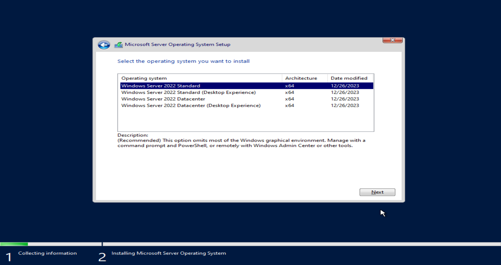

# Windows WIM Hex Time Converter

<br />

---

<br />

## About
This tool allows you to convert the timestamps located in the `[1].xml` file. This XML file is inside the `install.wim` archive for Windows installations.

<br />

<p align="center"></p>

<br />

<p align="center"></p>


<br />

---

<br />

## install.wim Location
Open a bootable Windows ISO image and navigate to the folder `$ISO_HOME\sources\install.wim`

<br />

---

<br />

## Editing `CREATIONTIME` & `LASTMODIFICATIONTIME`
If you open `install.wim` with a program such as 7-zip, you'll see a file inside labeled `[1].xml` which is where the values are stored. Unfortunately, 7-zip does not allow you to edit this file, so you'll have to use another program called `Winlib` located at https://wimlib.net/downloads/index.html

Download the above program and extract it somewhere on your machine. Then take a copy of the `install.wim` file and place it inside the same folder as the Winlib files.

To change the dates, you will need to figure out the values for `HIGHPART` and `LOWPART`, which is where this web tool comes into play. View the `index.html` file and convert a human-readable date / time into the two segments you'll need.

After you have the two new segments for your date and time, open a new comment prompt / terminal and navigate to the folder where you placed Winlib and the install.wim, and then execute the command:

```
wimlib-imagex info install.wim 5 --image-property CREATIONTIME/HIGHPART=0x01DA37F0 --image-property CREATIONTIME/LOWPART=0x26C3FE94

wimlib-imagex info install.wim 5 --image-property LASTMODIFICATIONTIME/HIGHPART=0x01DA37F0 --image-property LASTMODIFICATIONTIME/LOWPART=0x26C3FE94
```

Executing the above command will modify the fields `CREATIONTIME/HIGHPART` and `CREATIONTIME/LOWPART` with the values you have specified.

Once the command is executed, you can re-open the `install.wim` file in 7-zip again and re-open the `[1].xml`, which should now have the updated values:

```xml
<CREATIONTIME>
	<HIGHPART>0x01DA37F0</HIGHPART>
	<LOWPART>0x26C3FE94</LOWPART>
</CREATIONTIME>
<LASTMODIFICATIONTIME>
	<HIGHPART>0x01DA37F0</HIGHPART>
	<LOWPART>0x26C3FE94</LOWPART>
</LASTMODIFICATIONTIME>
```

<br />

After you've modified the values, you can then create a new Windows ISO with the updated `install.wim` file. Tools such as the [MSMG Toolkit](https://github.com/thecodermehedi/msmg-toolkit) can be used.